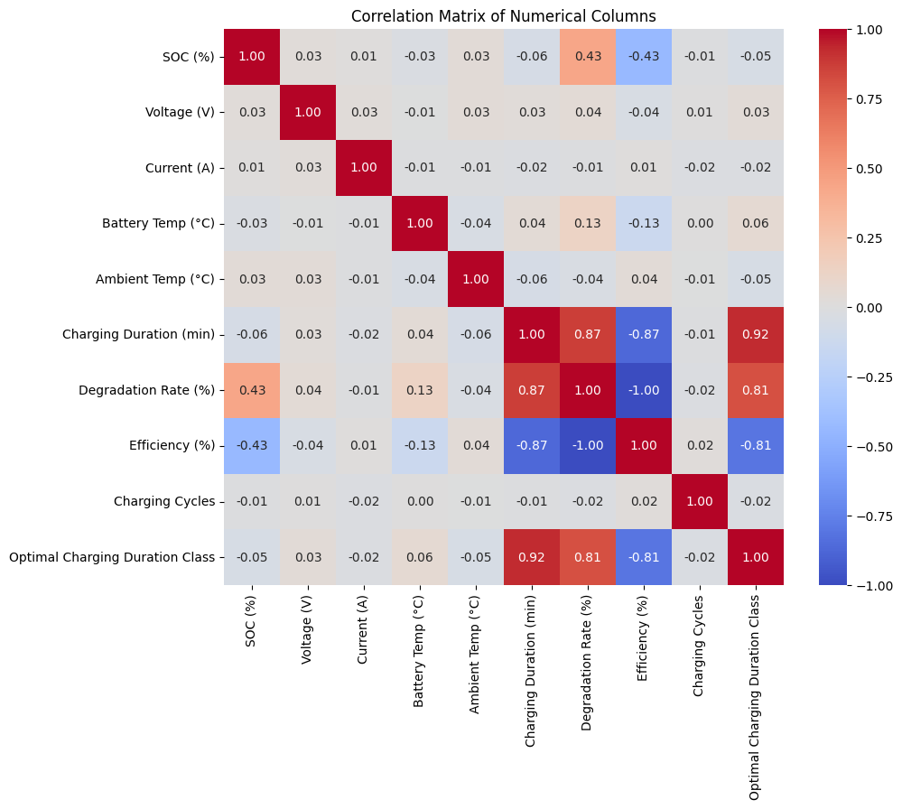
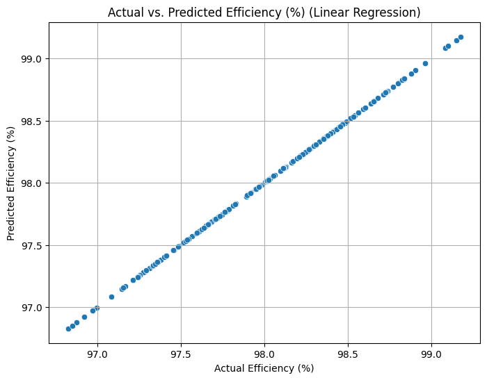
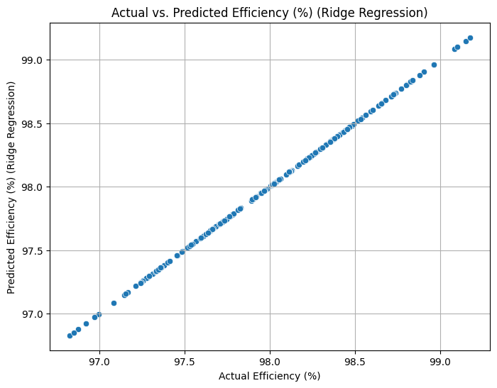
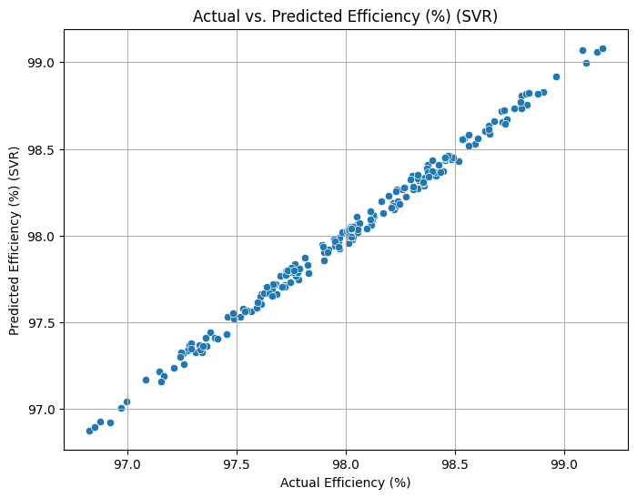
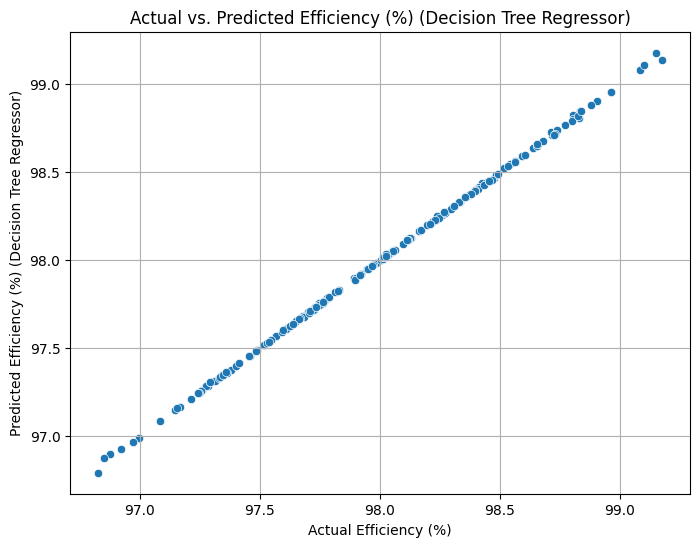

## EV battery data analysis and modelling for battery efficiency prediction

* In this exercise a data set about battery efficiency and other factors is analysed.
* The data visualization helps understand the relation between different features. Correlation matrix will be useful to visualize it.
* Finally 4 models i.e Linear Regression, SVR, Ridge Regression, DecisionTree will be used to find best approach to predict battery efficiency.

### Goal 
* Exploring factors affecting battery efficiency for electric vehicles using the Data analysis techniques and develop a model that can help predict battery efficiency given various factors as input.

### Data source 
For this exercise, a battery dataset is sourced from Kaggle. Here is a summary of dataset
[Link](https://www.kaggle.com/datasets/ziya07/ev-battery-charging-data ) to dataset - 

* Features in dataset- SOC (%) ,Voltage (V), Current (A) ,Battery Temp (°C) ,Ambient Temp (°C),Charging Duration (min), Degradation Rate (%) ,Charging Mode , Battery Type ,Charging Cycles ,EV Model , Optimal Charging Duration Class
* Label to predict - Efficiency (%)

### Here is a correlation matrix shoring the feature importance

### Finally multiple model were compared - Below is the output of cross-validation
|index|Mean R-squared|Std R-squared|Mean MSE|Std MSE|
|---|---|---|---|---|
|Linear Regression|1\.0|0\.0|3\.2412716873720933e-28|2\.728550907703143e-28|
|SVR \(Linear Kernel\)|0\.9930247264223636|0\.0006662635992101016|0\.0020446313461645114|0\.00015566171385450627|
|Ridge Regression|0\.9999999999520439|7\.749199579057938e-12|1\.4266046064811315e-11|3\.2195194509826147e-12|
|Decision Tree Regressor|0\.9996933214188539|0\.00015980247021748733|8\.581646384732027e-05|3\.34733944716071e-05|

* Linear regression and Ridge linear regression seems to be the best options, due to their performance and simplicity.
* However, when implemented in the practcle application with large training data, it ll be important to be cautious of overfitting.
* Visualise the predictions and actual data for different models

|  |  |
| :---: | :---: |
| **Linear Regression**    | **Ridge Regression**    |
| **SVR**    | **Decision Tree Regression**    |

### Next
* More data can be sources, to enrich the model.
* Datapipelines to source the data can be created and deployed.
* In future I plan to work on deploying this as a webapp to learn about deploying and hosting ML based apps.

